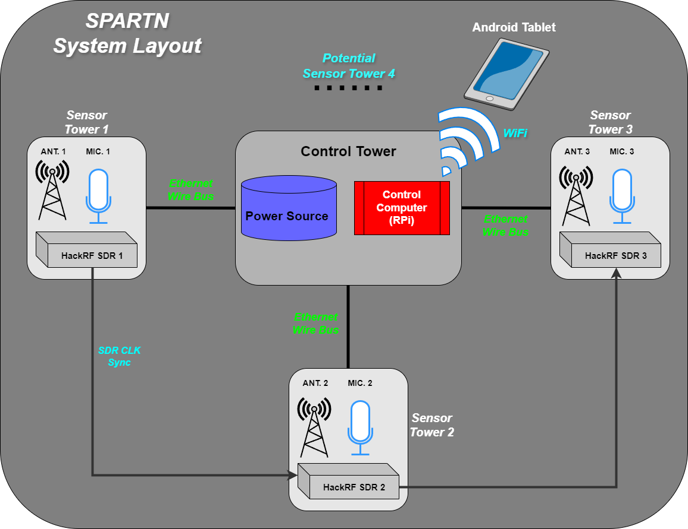

# Drone Detection Network (SPARTN)

## Project Summary
The **Drone Detection Network (SPARTN - Sensor Platform for Acoustic and Radio Tracking Network)** aims to address the growing challenges posed by the rapid expansion of drone technology. By utilizing a low-cost, lightweight distributed sensor network, the system will detect and classify drones using a combination of radio frequency (RF) and acoustic signals. The network will provide real-time 3D positioning and classification (friendly or hostile) of drones via an Android tablet application, enhancing civilian safety and operational efficiency in restricted airspaces.

---

## Current Functionality
### Features
1. **Sensor Data Acquisition**:
   - RF and audio signals are captured and processed by sensor towers.
   - Raspberry Pi acts as the central control tower.
   
2. **Drone Classification**:
   - A trained MATLAB CNN model analyzes 1-second audio samples to determine drone presence.

3. **User Interface**:
   - Android tablet application displays drone positions and communicates with the Raspberry Pi via TCP.

4. **Networking**:
   - Successful communication between the Raspberry Pi and the tablet application.

### Results
- Basic proof of concept for detecting drones using RF and audio signals.
- Functional tablet application built with Java (Android Studio) for user interaction.
- Networking established with AES encryption to secure communication.

---

## Proposed Future Functionality
### Key Innovations

1. **Enhanced User Interface**:
   - Real-time drone location and classification display on the tablet.
   - Debugging interface for system optimization.

2. **Improved Machine Learning**:
   - Real-time drone classification with an accuracy goal of 75%.
   - Expanded datasets for distinguishing friend or foe drones.

3. **Streamlined Hardware**:
   - USB microphones integrated with the Raspberry Pi for audio signal processing.
   - TDOA localization to enhance detection accuracy.

4. **Custom System Design**:
   - Hybrid detection method combining RF and audio for high accuracy.
   - Compact, portable system powered by centralized control towers.

5. **Advanced Mathematics for Localization**:
   - Algorithm development for RF signal triangulation using spherical intersection methods.

### Planned Milestones
| **Milestone ID** | **Milestone Name**                         | **Date Scheduled** | **Notes**                                 |
|------------------|-------------------------------------------|---------------------|------------------------------------------|
| 1                | C++ Code for Audio Monitoring            | 1/27/25            | Mikhail ***completed*** on 1.24.25              |
| 2                | Audio Signal Processing for TDOA         | 2/3/25             | Mikhail - Python code that correlates and gives a TDoA of each sound, but need more **testing** to verify. |
| 3                | TDOA Algorithm Development               | 2/10/25            | Mikhail **implemented** in Python 1.30(Giving location predictions on 2.2) - Nick adapted to CPP 1/30.   Fidelity testing done on 2/11. Functionl implmentation with fidelity information attempted on 2/12. more testing fill follow.|
| 4                | Directional Antenna Construction         | 2/17/25            | Fabricate directional antennas. RF **completed** as a group on 2.19. Audio **completed** as a group on 2.27 |
| 5                | Antenna Integration                      | 2/24/25            | Integrate with existing systems. **(Missed)** |
| 6                | AI Audio Classification Model            | 3/3/25             | Real-time binary prediction **completed** in MATLAB by Nick on 2/5   |
| 7                | Real-Time Audio Classification           | 3/10/25            | Implement live audio classification.      |
| 8                | RF Spectrum Display on Tablet            | 3/17/25            | Add RF visualization to the UI.           |
| 9                | Full System Communication Integration    | 3/24/25            | Include encrypted communication.          |
| 10               | Real-Time Drone Location Display         | 3/31/25            | Complete tablet UI for location tracking. |
| 11               | Classification Display on Tablet         | 4/7/25             | Enhance the tablet interface.             |
| 12               | Real-Time System Processing              | 4/14/25            | Ensure all processes work seamlessly.     |
| 13               | Comprehensive System Testing             | 4/21/25            | Evaluate all system components.           |
| 14               | Demonstration Meeting Market Standards   | 4/28/25            | Final demonstration and evaluation.       |

---

## Environmental and Societal Impacts
- **Environmental Impact**: Minimal due to lightweight design and recyclable materials.
- **Societal Impact**: Enhances safety and accountability in restricted airspaces.
- **Security**: AES encryption ensures secure communication between devices.
- **Interoperability**: Addresses potential challenges with future drone designs.
- **Health and Safety**: Rainproof system design to mitigate fire and electric shock risks.
- **Regulatory Compliance**: Adheres to FCC and FAA regulations for RF operation and drone testing.

---

## Testing
- **Detection Range**: Verify RF and acoustic detection capabilities up to 30m (100 ft).
- **Classification Accuracy**: Ensure 75% accuracy in real-world noise conditions.
- **Positioning Precision**: Confirm accuracy within 3m (10 ft).
- **Cybersecurity**: Test encrypted communication with Wireshark.
- **System Reliability**: Perform one-hour stress tests for power and data transfer.

---

## Conclusion
The **SPARTN Drone Detection Network** offers an innovative, affordable, and portable solution to detecting and tracking drones in real-time. By combining RF and acoustic detection, the system provides a comprehensive tool for safeguarding civilian and military airspaces. Our future work will focus on refining detection accuracy, classification capabilities, and system reliability.

---

## References
- [Dedrone by Axon](https://www.dedrone.com)
- [DJI Aeroscope](https://www.dji.com/aeroscope)
- [Squarehead Technology](https://www.sqhead.com/drone-detection)
- Additional academic citations as per the project documentation.

